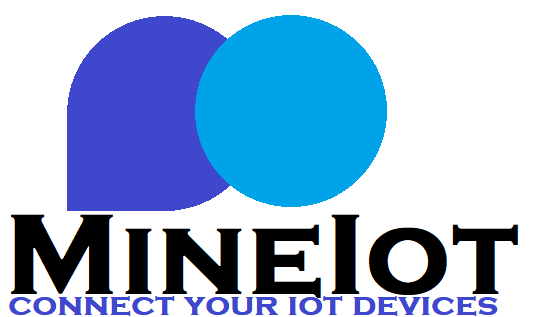

# MineIoT
MineIoT is project created for Company and private who wants to manage their IoT Devices without any worries about the IT infrastructure.
MineIoT is based on the Cloud provider [Microsoft Azure](https://azure.microsoft.com/it-it/) that provides all the required services to build and deploy the project.

<p align="center"></p>

MineIoT provides the following features:

- creating and deleting iot devices;
- streaming almost real-time of IoT devices data into Database;
- creating and deleting charts to a better udnerstending of data;
- user-friendly dashboard accesible at all times from everywhere.

The figure below shows:

- the platforms that the user can use to interact with MineIoT;
- the services used to realize the project and their interaction.

<p align="center"></p>

This tutorial aims to show how it is possible to take advantage of the Azure services to develop a full functional infrastructure for the management of iot devices on the cloud.
This tutorial also shows you how to test the Web Application locally using node.js express.

#### Tutorial Structure

* **[Prerequisites](#prerequisites)**
* **[Installation](#installation)**
* **[Resources](#resources)**
* **[Execution](#execution)**

## Prerequisites
- [An Azure Subscription](https://portal.azure.com/)
- A Google Account
- Node.js
- [Azure CLI](https://docs.microsoft.com/it-it/cli/azure/install-azure-cli)
- [Any IOT devices Emulator](https://azure-samples.github.io/raspberry-pi-web-simulator/)

## Installation
This tutorial is designed to be runned on a Windows/OS system.

Install [Node](https://nodejs.org/it/download/),
Download [MineIoTWebApp](https://github.com/GerryDps/MineIoT)
Then you can start the server locally, or upload it on Azure App Services
```bash
cd MineIoTWebApp
npm start
```


## Resources
Based on [Azure App Services](https://learn.microsoft.com/en-us/azure/app-service/) MineIoT utilises Microsoft Azure services to run, furthermore the available functionalities exploit several Azure services that are connected to the WebApp using specific credentials.
In this section a tutorial for the creation of all the required Azure resources is proposed, both the [Portal](https://portal.azure.com) and the Azure CLI will be used. In order to maintain the cost low as much as possible will be chosen the free tier when available.

**REMINDER** Every resource on Cloud needs some deployment time that in some cases can be quite long, be patient.

### Resource Group
First thing first an Azure Resource Group is required, this is pretty straightforward to do using the Azure Portal and can also be done dinamically while creating the first resource.

### IoT Hub
[IoT Hub](https://learn.microsoft.com/en-us/azure/iot-hub/) is a managed service hosted in the cloud that acts as a central message hub for communication between an IoT application and its attached devices. You can connect millions of devices and their backend solutions reliably and securely. Almost any device can be connected to an IoT hub.
MineIoT uses IOT HUB to create, delete, and manage iot devices of the client.

Using the Azure Portal.
1. Create a new resource and using the search bar find 'iot hub'.
2. Leave all the options as default and provide the  details for the Subscription, Resource Group and the name. 
3. Choose 'Princing tier' F0 (Free).
4. Leave all the others tabs as default.

When the resource is been correctly deployed go to the resource.

1. In the lateral menu, under 'Security settings' choose 'Shared access policies' click on 'iothubowner'.
2. Copy one of the two keys and paste it in "\MineIoTWebApp\private\iotHub\devices\manageDevice.js" at line 9 "signinKey": "paste here".
3. Copy the resource URI and paste it at line 5, usally is 'YourIotHubName-iot-hub.azure-devices.net'

(You can also create a new polices specific for this use, in that case you must change the 'policyName' field).

### CosmosDB
[Azure Cosmos DB](https://learn.microsoft.com/en-us/azure/cosmos-db/introduction) is a globally distributed database platform for both NoSQL and relational databases of any scale.
MineIoT uses NoSQL Cosmos DB to storage all the data coming from the IoT Devices.

Using the Azure Portal.
1. Create a new resource and using the search bar find 'cosmos db'.
2. Under 'Azure Cosmos DB for NoSQL' click the button Create
3. Provide the details for the Subscription, Resource Group and the name. 
3. Choose the Region and leave the remaining fields as default.
4. Click on 'Review + create' and 'Create'.

When the resource is been correctly deployed go to resource.

1. In the lateral menu choose 'Data Explorer' and create a new container using the button.
2. Select the name of the new database.
3. Leave the remaining fields as default.
4. In the lateral menu under 'Settings 'choose 'Keys' and copy URI and one of the two keys.
5. Paste the URI and the keys in "\MineIoTWebApp\private\database\charts\chartCosmosDB.js" at line 4 and 5.

### Stream Analytics jobs
[Stream Analytics jobs](https://learn.microsoft.com/en-us/azure/stream-analytics/stream-analytics-introduction) is a fully managed stream processing engine that is designed to analyze and process large volumes of streaming data with sub-millisecond latencies.
In MineIoT is needed to manage the streaming of the data coming from the iot devices into the CosmosDB noSQL database.

Using the Azure Portal.
1. Create a new resource and using the search bar find 'stream analytics'.
2. Provide the details for the Subscription, Resource Group, the name and the Location.
3. Set 'Streaming unit' to 1.
4. Leave the remaining fields as default.

When the resource is been correctly deployed go to resource.

1. In the lateral menu choose 'Inputs' and click the button 'add stream input' , 'IoT Hub'.
2. Insert the name, select the correct IoT Hub from the list and hit Save.
3. In the lateral menu choose 'Outputs' and click on 'add', select 'CosmosDb' from the list.
4. Insert the name, select the correct CosmosDB database and container from the list.
5. Select Connection String as 'Authentication mode', hit Save.
6. In the lateral menu choose 'Query', in this case we want to stream all the data, the query will be 'SELECT * INTO output FROM input'.
7. Use 'Save query' button to save.
8. Start the Stream Analytics job, remember to stop the resource when done.

### SQL Database Server
[SQL Database Server](https://learn.microsoft.com/en-us/azure/azure-sql/database/sql-database-paas-overview?view=azuresql) is a fully managed platform as a service (PaaS) database engine that handles most of the database management functions, is always running on the latest stable version of the SQL Server database engine and patched OS with 99.99% availability.

Using the Azure Portal.
1. Create a new resource and using the search bar find 'sql server'.
2. Provide the details for the Subscription, Resource Group, the name and location.
3. Select 'Use SQL authentication' as Authentication method.
4. Provide the login and password.
5. Hit the button Next to go in networking settings.
6. In firewall rules select Yes.
3. Hit review and create.

When the resource is been correctly deployed go to resource.

1. In the lateral menu choose 'Overview', click on 'Create Database'.
2. Provide the details for the Subscription, Resource Group, the database name and select the correct server.
3. For cost reasons we'll configure database with basic tier and locally redundant backup.
4. Hit Review + create.

### SQL Database
[SQL Database](https://learn.microsoft.com/en-us/azure/azure-sql/database/sql-database-paas-overview?view=azuresql).

Using the Azure Portal.
1. Using the search bar find 'sql database'.
2. Select the database just created.
3. In the lateral menu choose 'Query editor', login into sql.
4. You need to allow your current ip by clicking 'allow current ip'
5. Create a new table named CHARTS:
```
CREATE TABLE CHARTS (
    deviceId varchar(255) NOT NULL,
    label varchar(255) NOT NULL,
    email varchar(255) NOT NULL,
    PRIMARY KEY (deviceId,label)
);
```
6. In the lateral menu choose 'Overview' and copy the server name.
7. Edit the file "\MineIoTWebApp\private\database\charts\chartSQLdb.js" at the lines 4,5,6,8 with your own settings.

### App Services
[App Services](https://learn.microsoft.com/en-us/azure/iot-hub/) is a service hosted in the cloud that enables you to build and host web apps, mobile back ends, and RESTful APIs in the programming language of your choice without managing infrastructure. It offers auto-scaling and high availability, supports both Windows and Linux, and enables automated deployments from any Git repo.

Using the Azure Portal.
1. Create a new resource and using the search bar find 'app services'.
2. Leave all the options as default and provide the  details for the Subscription, Resource Group and the name. 
3. Select 'Code' as Publish, 'Node 18 LTS' as Runtime stack, 'Linux' as System.
3. Choose 'Princing tier' F1 (Free).
4. Leave all the others tabs as default.

When the resource is been correctly deployed go to the resource.
(no needed if testing on local machine)

1. In the lateral menu, under 'Deployment' choose 'Deployment Center'.
2. Copy and use the FTP credential to upload the MineIoTWebApp on the server.
3. In the lateral menu, under 'Settings' choose 'Authentication'.
4. Click on the button add to add a new identity provider.
5. Select google and pase the client id, client secret.
6. Select 'Require authentication' and 'HTTP 401'

### Additional resource: ID client OAuth 2.0
The Google API key is a unique identifier needed for authentication purpose. You can follow this [TUTORIAL](https://developers.google.com/identity/gsi/web/guides/get-google-api-clientid) to get your personal client id and client secret.
Rememeber to set the redirect URI during the config for the google id client.

## Execution
The Web App can run both on Cloud and locally using the Node.js. Web app will work in the same way but is clearly better to run the bot in a local environment while testing the web pages.

***ATTENTION*** All the aforementioned resources are nevertheless necessary to ensure proper operation of MineIoT even in a local environment except for the App Service.

### Local hosting
#### Testing the bot with Bot Framework Emulator
1. Open a terminal in MineIoT folder and start the web app
```
npm start
```
2. Open the browser and go to localhost
3. Use [Any IOT devices Emulator](https://azure-samples.github.io/raspberry-pi-web-simulator/) to generate messages.

**WARNING** The following guide is outdated in some parts. The Azure services are continously updated.

### Cloud hosting
1. Follow the [tutorial](#app-services) to upload MineIoTWebApp on the Azure App Services.
2. Open the link "https://yourWebAppName.azurewebsites.net"
3. You need to login at "https://yourWebAppName.azurewebsites.net/.auth/login/google/".
4. Use [Any IOT devices Emulator](https://azure-samples.github.io/raspberry-pi-web-simulator/) to generate messages.

**Authors**
Cloud Computing - Dipartimento di Informatica - Università degli Studi di Salerno
- Manuel Di Matteo
- Gerardo Di Pascale
